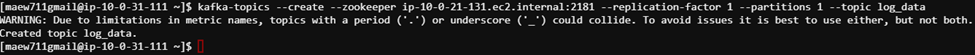
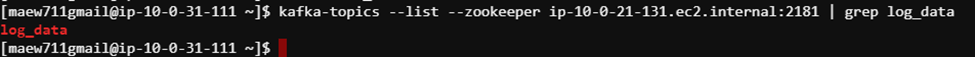
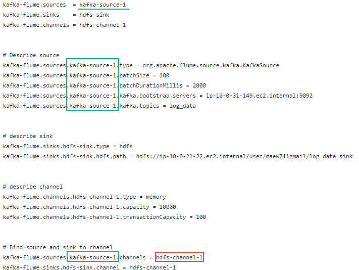
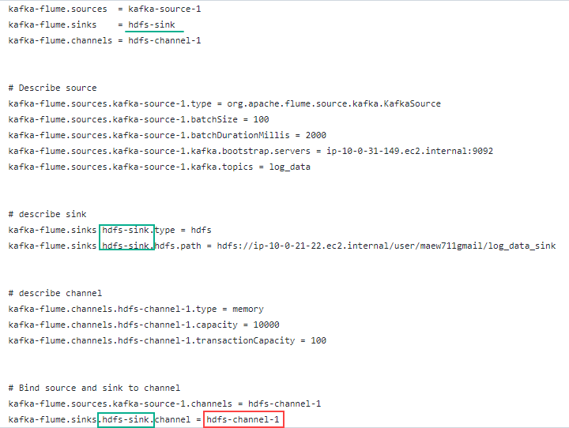
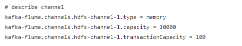
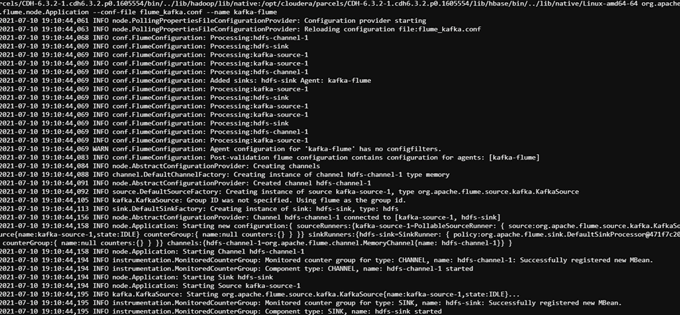
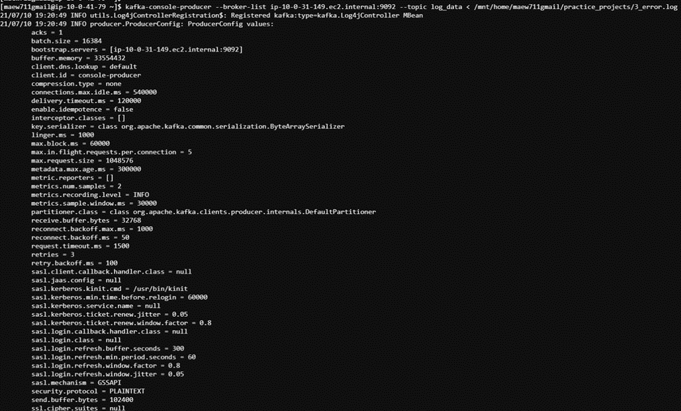
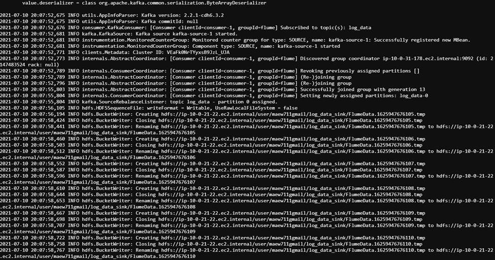
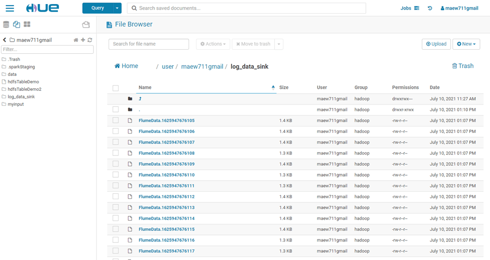

## Data Ingestion - Kafka to Flume
A retail e-commerce giant in the US has a web portal where customers can purchase items, and the sellers can add products, remove the products, and do inventory-related operations. Recently, they started getting a lot of errors on the portal. They have collected these errors from all the applications and compiled them into log CSV files.

Processing log files is a big task as an application can generate a lot of logs in a single day. They want to send all logs to HDFS so they can check which are the most frequent errors they are getting.

The error log file containing the below details.

- Dates
- Server
- Error message

The goal for this project is to read error logs from Kafka and push it 
into HDFS. 

#### Setup Apache Flume to ingest log data from Apache Kafka
1. Create Kafka producer which reads the CSV log file data one by one and pushes it to Kafka
2. Write flume configuration where the source is Kafka and the sink is HDFS
<br/>


*Images sourced from <ins>SimpliLearn Big Data Hadoop and Spark Developer Certification</ins>*

### 1. Create Kafka Topic

```bash
$ kafka-topics --create --zookeeper ip-10-0-21-131.ec2.internal:2181 --replication-factor 1 --partitions 1 --topic log_data
```

<br/>**Command Line Output**






### 2. Configure Flume Agent
The flume agent called `kafka-flume` is a Java process that is comprised of a **source**, **channel**, and **sink**.

#### Source<br/>
The `kafka-flume source` is configured to receive log events from a Kafka Source topic called log_data. 



#### Sink<br/>
The `kafka-flume sink` is configured to send Kafka log events to its destination which is set to HDFS.



#### Channel<br/>
Sitting between the Source and Sink is a memory channel which serves as buffer between the source and sink.  The channel will buffer events received from the Flume source in the event that log messages are received at a faster rate than which they get sent to the HDFS destination.

The `hdfs_channel-1` can store a maximum of 10,000 log events in the memory channel.  It will send a maximum of 100 log events to HDFDS per transaction.



### 3. Run Flume Agent

```bash
$ flume-ng agent --conf conf --conf-file flume_kafka.conf --name kafka-flume
```

<br/>**Command Line Output**




### 4. Run Kafka Producer

```bash
$ kafka-console-producer --broker-list ip-10-0-31-149.ec2.internal:9092 --topic log_data < /mnt/home/maew711gmail/practice_projects/3_error.log
```

<br/>**Command Line Output**




### 5. View Terminal output from Flume command




### 6. Flume files created in sink folder



