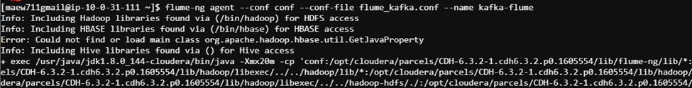
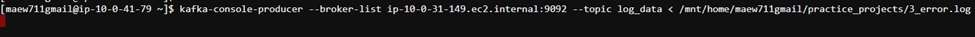

## Data Ingestion Kafka to Flume

### Setup Apache Flume to ingest log data from Apache Kafka


### 1. Create Kafka Topic

```bash
$ kafka-topics --create --zookeeper ip-10-0-21-131.ec2.internal:2181 --replication-factor 1 --partitions 1 --topic log_data
```

<br/>**Command Line**


### 2. Run Flume Agent

```bash
$ flume-ng agent --conf conf --conf-file flume_kafka.conf --name kafka-flume
```

<br/>**Command Line**




### 3. Run Kafka Producer

```bash
$ kafka-console-producer --broker-list ip-10-0-31-149.ec2.internal:9092 --topic log_data < /mnt/home/maew711gmail/practice_projects/3_error.log
```

<br/>**Command Line**




### 4. View Terminal Console output from Flume command


### 5. Flume files created in sink folder


