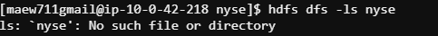
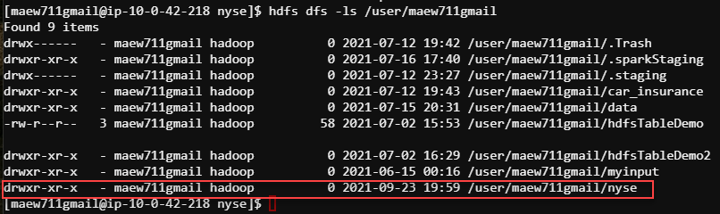
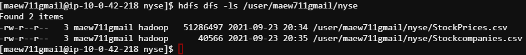
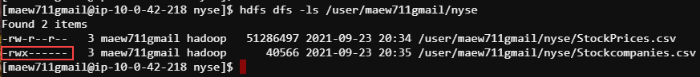
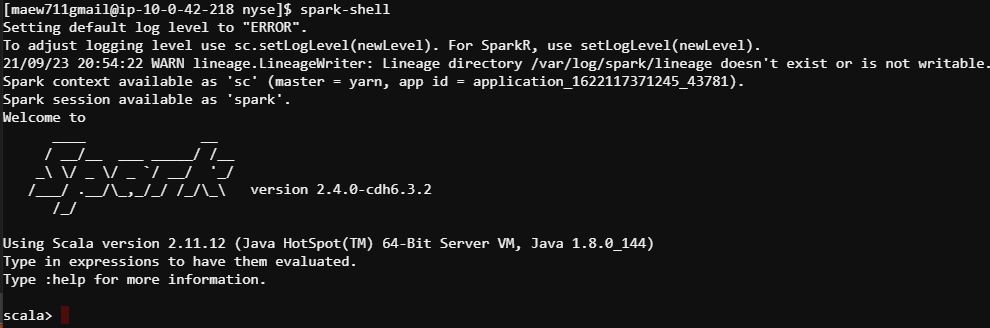

# HDFS Command Line
This is a practice project from the SimpliLearn Big Data Hadoop and Spark Developer certification. The goal of this project is to practice HDFS commands from the command line terminal.

## Steps to Perform
Using command lines of HDFS, perform the below tasks:

**1. Check if "nyse" hdfs directory exists**

         hdfs dfs -ls nyse
         

**2. Create a directory named “nyse"**

         hdfs dfs -mkdir nyse

**3. Transfer a sample text file from your local file system to HDFS directory**

         hdfs dfs -put /mnt/home/maew711gmail/nyse/StockPrices.csv nyse
         hdfs dfs -put /mnt/home/maew711gmail/nyse/Stockcompanies.csv nyse

**4. List the files in HDFS directory**

         hdfs dfs -ls /user/maew711gmail/nyse 

**5. Change the permissions on the file to read, write and execute**

         hdfs dfs -chmod 700 nyse/Stockcompanies.csv

 

## Spark Shell at Command Line

**1. Launch Spark Shell**

**2. Read Stock Prices CSV file into DataFrame**

    val df = spark.read.format("csv").option("header", "true").option("inferschema","true").option("delimiter",",").load("/user/maew711gmail/nyse/StockPrices.csv")

    

