## Market Analysis in Banking Domain
A marketing campaign was done to convince potential customers to invest in a bank term deposit product. The marketing campaign was done through phone calls, and often the same customer was contacted more than once, in order to assess if they wanted to invest in the bank term deposit or not. 

Using Spark Scala, perform the marketing analysis of the data generated by this campaign.
 

### Dataset Description
| column      | description                                                                                                                                                                  |
|-------------|------------------------------------------------------------------------------------------------------------------------------------------------------------------------------|
| age         | numeric                                                                                                                                                                      |
| job         | type of job (categorical: 'admin.','blue-collar','entrepreneur','housemaid','management','retired','self-employed','services','student','technician','unemployed','unknown') |
| marital     | marital status (categorical: 'divorced', 'married', 'single', 'unknown'; note: 'divorced' means divorced or widowed)                                                         |
| education   | (categorical: 'basic.4y','basic.6y','basic.9y','high.school','illiterate','professional.course','university.degree','unknown')                                               |
| default     | has credit in default? (categorical: 'no', 'yes', 'unknown')                                                                                                                 |
| housing     | has housing loan? (categorical: 'no', 'yes', 'unknown')                                                                                                                      |
| loan        | has a personal loan? (categorical: 'no', 'yes', 'unknown')                                                                                                                   |
| contact     | contact communication type (categorical: 'cellular'                                                                                                                          |
| month       | Month of last contact (categorical: 'jan', 'feb', 'mar', ..., 'nov', 'dec')                                                                                                  |
| day_of_week | last contact day of the week (categorical: 'mon','tue','wed','thu','fri')                                                                                                    |
| duration    | last contact duration in seconds (numeric)                            |
| campaign    | number of times customer was contacted during the campaign            |
| pdays       | number of days passed after the customer was last contacted from previous campaign |
| previous    | number of times the customer was contacted prior to (or before) this campaign (numeric)|
| poutcome    | outcome of the previous marketing campaign (categorical: 'failure', 'nonexistent', 'success')|
| y           | success outcome of current campaign (yes or no)                         |

 

### Analysis Steps

1. Load data and create a Spark data frame

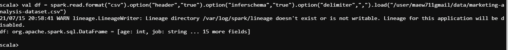

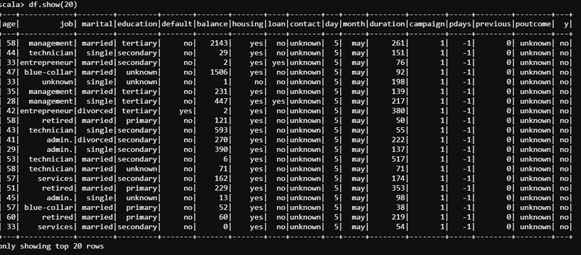

2. Give marketing success rate as (No. of people subscribed / total no. of entries)   

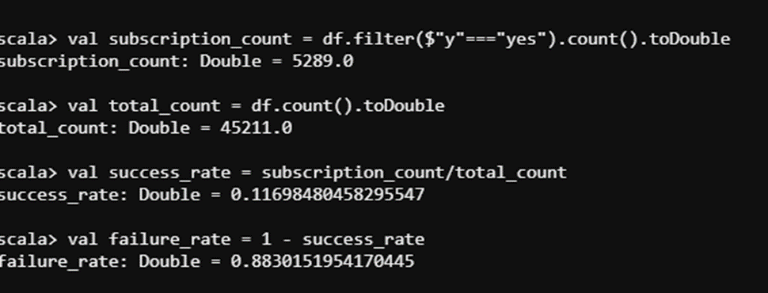

3. Give the maximum, mean, and minimum age of the average targeted customer

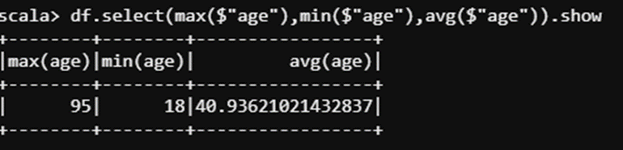

4. Check the quality of customers by checking average balance, median balance of customers

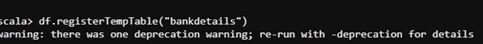

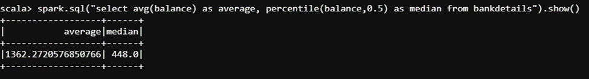

5. Check if age matters in marketing subscription for deposit

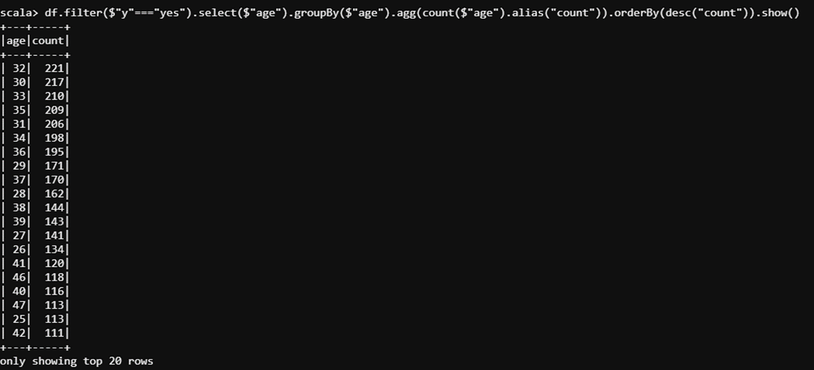

6. Check if marital status mattered for a subscription to deposit

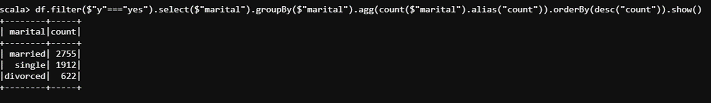

7. Check if age and marital status together mattered for a subscription to deposit scheme

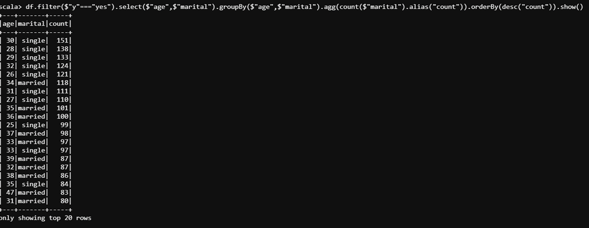

8. Do feature engineering for the bank and find the right age effect on the campaign

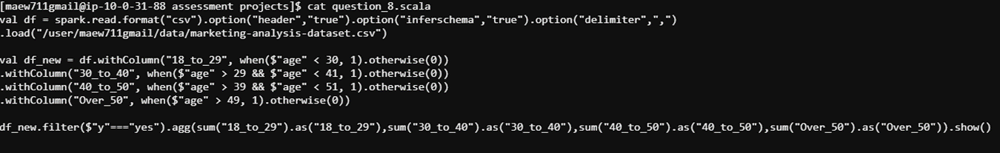

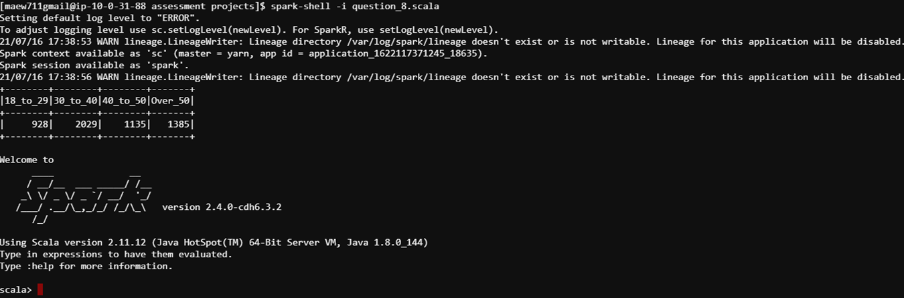

