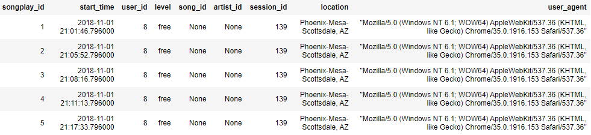

# Data Modeling with Postgres

An ETL (Extract, Load, Transform) process was created for a fictitious company called Sparkify.  The sparkifydb database is based on a STAR schema.  The sparkifydb database has five tables: songs, artists, time, users, and song plays.

## Setup Instructions
<ins>Setup new Postgres database server before creating and loading the new database</ins>

1. Pull latest Postgres image container from Docker Hub https://hub.docker.com 

2. Execute this command from the Terminal to pull latest Postgres Docker container
> docker pull postgres

3. Create a Docker volume for persistent storage
> docker volume create pgdata

4. Run new Postgres Docker container
>docker run --name postgres_test -v pgdata://var/lib/postgresql/data -e POSTGRES_PASSWORD=mypassword -p 5432:5432 -d postgres

5. Connect to Postgres localhost server from Python IDE such as [PyCharm](https://www.jetbrains.com/pycharm/) or [Visual Studio Code](https://code.visualstudio.com/)

## Database Design

There are two categories of data files in json format, event log data and song data.  The event log data gets loaded into the songplays
fact table.  The dimension data is loaded from the song data files. An ETL pipeline written in Python extracts attributes
from the json event log and song files, and loads the data attributes into the PostgreSQL sparkifydb database tables.

## Song Data

The files follow a naming convention as **TRABCEI128F424C983.json**. A sample json record looks like:

    {"num_songs": 1, "artist_id": "ARJIE2Y1187B994AB7", "artist_latitude": null, "artist_longitude": null, "artist_location": "",
     "artist_name": "Line Renaud", "song_id": "SOUPIRU12A6D4FA1E1",
     "title": "Der Kleine Dompfaff", "duration": 152.92036, "year": 0}

## Event Log Data

An example json file is **log_data/2018/11/2018-11-13-events.json**. A sample record looks like.

    {"artist":"Gustavo Cerati","auth":"Logged In","firstName":"Adler","gender":"M","itemInSession":1,"lastName":"Barrera","length":249.44281,"level":"free",
     "location":"New York-Newark-Jersey City, NY-NJ-PA","method":"PUT",
     "page":"NextSong","registration":1540835983796.0,"sessionId":248,
     "song":"Uno Entre 1000","status":200,"ts":1541470383796,
     "userAgent":"\"Mozilla\/5.0 (Macintosh; Intel Mac OS X 10_9_4) AppleWebKit\/537.78.2
     (KHTML, like Gecko) Version\/7.0.6 Safari\/537.78.2\"","userId":"100"}

## ETL Pipeline

### Extract

The song and event log json files are loaded into Pandas DataFrame objects

### Transform

Once the json data is loaded into the Pandas DataFrames, the data attributes are transformed into PostgreSQL data types.
For example, the start_time from the event log data is converted to a timestamp data type.

### Load

The data attributes are then loaded into the sparkifydb database tables

## sparkifydb Queries

     SELECT * FROM songplays LIMIT 5;

     SELECT * FROM users LIMIT 5;

     SELECT * FROM songs LIMIT 5;

     SELECT * FROM artists LIMIT 5;

     SELECT * FROM time LIMIT 5;

## Running ETL Pipline

### At Terminal type:

     >python create_tables.py
     >python etl.py
